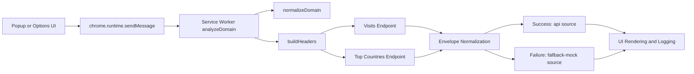

# Traffic Stats Analyzer Logging Library

A provider-agnostic JavaScript logging and traffic-observability library for Chrome extensions that normalizes domain telemetry, enriches API responses, and guarantees resilient fallback behavior.

[](#6-testing)
[](manifest.json)
[](LICENSE)
[](#6-testing)

> [!NOTE]
> This library is currently shipped as a Chrome Manifest V3 extension package and can be consumed as a modular logging/analytics runtime in extension-based architectures.

## Table of Contents

- [Table of Contents](#table-of-contents)
- [Features](#features)
- [Tech Stack & Architecture](#tech-stack--architecture)
- [Getting Started](#getting-started)
- [Testing](#testing)
- [Deployment](#deployment)
- [Usage](#usage)
- [Configuration](#configuration)
- [License](#license)
- [Support the Project](#support-the-project)

## Features

- Structured, provider-driven logging pipeline with configurable `baseUrl`, endpoints, and auth headers.
- Domain canonicalization primitives (`normalizeDomain`, `getHostFromUrl`) to prevent malformed telemetry dimensions.
- Asynchronous dual-stream retrieval model for visits and geography channels.
- Resilient failover semantics:
  - explicit mock mode (`useMock`)
  - automatic mock failover when API key is absent
  - automatic fallback envelope on transport and API errors
- Runtime response harmonization for multi-provider schemas (`visits | totalVisits | value`, `topCountries | countries`).
- Message-based worker orchestration (`ANALYZE_DOMAIN`) that decouples UI rendering from network execution.
- Persistent configuration surface backed by `chrome.storage.sync`.
- Extension-native UX integration through popup and options interfaces.
- Deterministic demo capability for onboarding, QA smoke tests, and API quota outage scenarios.

> [!IMPORTANT]
> The fallback-first design ensures logs and traffic insights remain available even during provider outages or misconfiguration.

## Tech Stack & Architecture

### Core Stack

- JavaScript (ES Modules)
- Chrome Extension APIs (Manifest V3)
- Service Worker background runtime
- HTML/CSS popup and options interfaces
- RapidAPI-compatible external provider integration

### Dependencies and Runtime Interfaces

- `chrome.runtime` for message dispatch and request orchestration
- `chrome.storage.sync` for persisted runtime configuration
- `chrome.tabs` for active-tab domain extraction
- `fetch` for provider API transport

### Project Structure

```text
Traffic-Stats-Analyzer/
├─ background/
│  └─ service-worker.js
├─ popup/
│  ├─ popup.html
│  ├─ popup.css
│  └─ popup.js
├─ options/
│  ├─ options.html
│  ├─ options.css
│  └─ options.js
├─ shared/
│  ├─ constants.js
│  ├─ domain.js
│  └─ mock-data.js
├─ styles/
│  └─ base.css
├─ manifest.json
├─ API_REFERENCE.md
├─ CONTRIBUTING.md
└─ LICENSE
```

### Key Design Decisions

- **Provider schema abstraction:** Provider metadata is externalized to configuration and not hardcoded into UI logic.
- **Canonicalization boundary:** Domain normalization happens before outbound requests to preserve metric consistency.
- **Fault-tolerant envelopes:** Every call resolves with a predictable response shape, even on error paths.
- **Parallel fetch strategy:** Visits and geography are collected concurrently to reduce end-to-end latency.
- **UI/worker separation:** UI modules focus on interaction and rendering, while networking stays in the service worker.



> [!TIP]
> When adding additional providers, preserve envelope contracts first and adapt provider fields second.

## Getting Started

### Prerequisites

- Google Chrome (latest stable)
- Git
- Optional: valid RapidAPI key for a Similarweb-compatible provider
- Optional local tooling for QA: `node` and `npm` (for lint/packaging checks)

### Installation

```bash
git clone https://github.com/<your-org>/Traffic-Stats-Analyzer.git
cd Traffic-Stats-Analyzer
```

```bash
# Open Chrome extension manager
# chrome://extensions
```

1. Enable Developer Mode.
2. Click **Load unpacked**.
3. Select the repository root.
4. Open popup and configure provider credentials.
5. Analyze the active tab domain or enter a custom domain.

> [!WARNING]
> Never hardcode production API keys in source files. Use runtime options storage only.

## Testing

This repository currently has no committed automated unit/integration test suite, so validation is done via linting and deterministic manual checks.

### Lint and Package Validation

```bash
npx --yes web-ext lint --source-dir .
```

### Suggested Local Test Commands (if you add test tooling)

```bash
npm run lint
npm run test
npm run test:integration
```

### Manual Validation Matrix

1. Verify domain auto-detection on an active browser tab.
2. Enable `useMock` and confirm stable demo payload rendering.
3. Disable `useMock`, set API key, and verify live provider output.
4. Intentionally break endpoint URL and confirm `fallback-mock` handling.
5. Save custom provider values and reopen popup to validate persistence.

> [!CAUTION]
> A green manual run does not guarantee provider contract compatibility across all third-party API versions.

## Deployment

### Production Readiness Checklist

- Bump `manifest.json` version for release.
- Validate permission scope and host patterns.
- Confirm provider endpoints and headers in options defaults.
- Run extension linting and full manual validation matrix.
- Create release archive excluding VCS metadata.

### Packaging

```bash
zip -r traffic-stats-analyzer.zip . -x '.git/*'
```

### CI/CD Integration Guidance

- Trigger release workflow on tags (`v*`).
- Run `web-ext lint` in CI before packaging.
- Publish zip artifact for release review and store upload.

```yaml
name: release-extension
on:
  push:
    tags: ["v*"]
jobs:
  package:
    runs-on: ubuntu-latest
    steps:
      - uses: actions/checkout@v4
      - run: npx --yes web-ext lint --source-dir .
      - run: zip -r traffic-stats-analyzer.zip . -x '.git/*'
```

## Usage

### Initialize and Trigger Analysis

```javascript
// Send a domain analysis request to the background logging pipeline.
const response = await chrome.runtime.sendMessage({
  type: 'ANALYZE_DOMAIN',
  domain: 'example.com' // Input can be raw URL or domain-like value.
});

// Normalize visits from multi-provider response contracts.
const visits = response.visits?.data?.visits
  ?? response.visits?.data?.totalVisits
  ?? response.visits?.data?.value
  ?? 0;

console.log('Domain:', response.domain);
console.log('Visits:', visits);
console.log('Top countries:', response.geography?.data?.topCountries || []);
```

### Domain Utility Usage

```javascript
import { normalizeDomain, getHostFromUrl } from './shared/domain.js';

const d1 = normalizeDomain('https://www.example.com/blog/post'); // example.com
const d2 = getHostFromUrl('https://news.example.com/path'); // news.example.com

console.log(d1, d2);
```

## Configuration

### Storage-Backed Configuration Model

- `provider.name`: Logical provider label.
- `provider.baseUrl`: Provider API base URL.
- `provider.endpoints.visits`: Visits endpoint prefix.
- `provider.endpoints.geography`: Geography endpoint prefix.
- `provider.headers.X-RapidAPI-Key`: Placeholder token expanded with `provider.apiKey`.
- `provider.headers.X-RapidAPI-Host`: Provider host header.
- `provider.apiKey`: Runtime API key entered by user.
- `useMock`: Boolean switch for demo/fallback behavior.

### Default Configuration Schema

```json
{
  "provider": {
    "name": "RapidAPI Similarweb",
    "baseUrl": "https://similarweb12.p.rapidapi.com",
    "endpoints": {
      "visits": "/v1/website/visits?domain=",
      "geography": "/v1/website/top-countries?domain="
    },
    "headers": {
      "X-RapidAPI-Key": "__REPLACE__",
      "X-RapidAPI-Host": "similarweb12.p.rapidapi.com"
    },
    "apiKey": ""
  },
  "useMock": true
}
```

### Environment Variables and Startup Flags

This project does not currently ship with `.env` ingestion or CLI startup flags. Configuration is runtime-driven through Chrome storage and the options UI.

If desired, CI environments can inject provider defaults by generating a patched `shared/constants.js` during build-time release workflows.

## License

Licensed under the Apache License 2.0. See [LICENSE](LICENSE) for full legal terms.

## Support the Project

[](https://www.patreon.com/OstinFCT)
[](https://ko-fi.com/fctostin)
[](https://boosty.to/ostinfct)
[](https://www.youtube.com/@FCT-Ostin)
[](https://t.me/FCTostin)

If you find this tool useful, consider leaving a star on GitHub or supporting the author directly.
