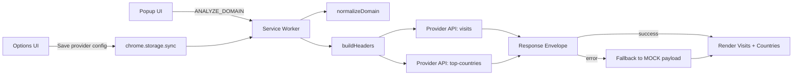

# Traffic-Stats-Analyzer

A Chrome Manifest V3 traffic intelligence library-style extension that analyzes domain visit volume and country distribution via a provider-driven API abstraction.

[](manifest.json)
[](manifest.json)
[](LICENSE)
[](API_REFERENCE.md)

> [!NOTE]
> This project is implemented as a browser extension with reusable JavaScript modules that behave like a lightweight logging/analytics integration layer for external traffic providers.

## Table of Contents

- [Features](#features)
- [Tech Stack & Architecture](#tech-stack--architecture)
- [Getting Started](#getting-started)
- [Testing](#testing)
- [Deployment](#deployment)
- [Usage](#usage)
- [Configuration](#configuration)
- [License](#license)
- [Support the Project](#support-the-project)

## Features

- Provider-based request pipeline with configurable `baseUrl`, endpoint mapping, and header templates.
- RapidAPI-oriented authentication model with runtime key injection (`__REPLACE__` token replacement).
- Domain normalization utilities for robust URL-to-domain extraction from active browser tabs.
- Parallel data retrieval for:
  - estimated visit volume
  - top traffic countries and share breakdown
- Graceful fallback behavior:
  - explicit demo mode (`useMock`)
  - automatic mock fallback on missing API key
  - automatic mock fallback on HTTP/network/runtime failures
- UI-level configuration editing directly from popup and options page.
- Chrome sync storage persistence for provider settings and feature flags.
- Manifest V3 service worker architecture with asynchronous message-based orchestration.
- API compatibility handling for heterogeneous response schemas (`visits`, `totalVisits`, `value`, `topCountries`, etc.).

> [!IMPORTANT]
> The extension intentionally fails open to mock data when upstream API access is unavailable, ensuring consistent UX during onboarding and quota exhaustion scenarios.

## Tech Stack & Architecture

- **Language:** Vanilla JavaScript (ES Modules)
- **Runtime:** Chrome Extension (Manifest V3)
- **Persistence:** `chrome.storage.sync`
- **Background Execution:** Service Worker (`background/service-worker.js`)
- **UI Surfaces:** Popup + Options page (HTML/CSS/JS)
- **External Integration:** Similarweb-compatible RapidAPI endpoints

### Project Structure

<details>
<summary>Expand file tree</summary>

```text
Traffic-Stats-Analyzer/
├─ background/
│  └─ service-worker.js
├─ icons/
│  └─ icon128.png
├─ options/
│  ├─ options.css
│  ├─ options.html
│  └─ options.js
├─ popup/
│  ├─ popup.css
│  ├─ popup.html
│  └─ popup.js
├─ shared/
│  ├─ constants.js
│  ├─ domain.js
│  └─ mock-data.js
├─ styles/
│  └─ base.css
├─ API_REFERENCE.md
├─ CONTRIBUTING.md
├─ LICENSE
└─ manifest.json
```

</details>

### Key Design Decisions

- **Provider abstraction over hardcoded endpoint logic** to enable swapping data providers with minimal UI changes.
- **Resilience-first data path** where API failures degrade into deterministic local mock payloads.
- **Single normalization boundary** (`normalizeDomain`) to keep provider requests and UI behavior consistent.
- **Message-driven architecture** (`ANALYZE_DOMAIN`) to isolate network logic from rendering logic.

<details>
<summary>Architecture and data flow (Mermaid)</summary>



</details>

> [!TIP]
> If you plan to support multiple providers, keep the endpoint contract stable at the rendering layer and evolve adapter logic in `service-worker.js`.

## Getting Started

### Prerequisites

- Google Chrome (current stable recommended)
- A RapidAPI subscription key for a Similarweb-compatible provider (optional when using mock mode)
- Git

### Installation

```bash
git clone https://github.com/<your-org>/Traffic-Stats-Analyzer.git
cd Traffic-Stats-Analyzer
```

1. Open `chrome://extensions`.
2. Enable **Developer mode**.
3. Click **Load unpacked**.
4. Select the repository root directory.
5. Open the extension popup and configure provider settings if needed.

<details>
<summary>Troubleshooting and alternative setup</summary>

### Troubleshooting

- If the popup shows fallback data only, verify your `X-RapidAPI-Key` in options.
- If the detected domain is empty, ensure the active tab has a valid `http`/`https` URL.
- If requests fail with host errors, check `baseUrl`, endpoint paths, and `X-RapidAPI-Host` alignment.
- If settings do not persist, verify Chrome sync storage availability for your profile.

### Build-from-source notes

This project is source-native and does not require a compile step. Packaging for distribution can be done by zipping the repository contents (excluding `.git`) and uploading to the Chrome Web Store developer dashboard.

</details>

> [!WARNING]
> Do not commit real production API keys to source control. Configure keys through extension options or environment-specific secret workflows.

## Testing

> [!NOTE]
> The repository currently does not include an automated unit/integration test harness.

Recommended checks:

```bash
# Validate manifest and extension package semantics via web-ext
npx --yes web-ext lint --source-dir .

# Run static formatting/linting only if you add project tooling
# Example placeholders:
# npm run lint
# npm run test
```

Manual verification checklist:

1. Open popup on a real domain tab.
2. Confirm domain auto-detection.
3. Trigger analysis with mock mode enabled.
4. Disable mock mode, provide API key, and re-run.
5. Validate fallback behavior by intentionally breaking endpoint URL.

## Deployment

### Production Deployment Guidelines

- Validate extension behavior in a clean Chrome profile.
- Ensure `manifest.json` version bump for each release.
- Package extension source into a release artifact (`.zip`) for store upload.
- Maintain provider endpoint compatibility and update API docs (`API_REFERENCE.md`) with contract changes.

### Suggested CI/CD Flow

1. Run lint/static checks.
2. Verify manifest integrity and permissions review.
3. Generate release archive.
4. Publish tagged release and upload package to Chrome Web Store.

<details>
<summary>Example GitHub Actions outline</summary>

```yaml
name: release-extension
on:
  push:
    tags:
      - 'v*'
jobs:
  package:
    runs-on: ubuntu-latest
    steps:
      - uses: actions/checkout@v4
      - name: Lint extension
        run: npx --yes web-ext lint --source-dir .
      - name: Create package
        run: zip -r traffic-stats-analyzer.zip . -x '.git/*'
```

</details>

## Usage

### Basic Usage

```javascript
// popup/popup.js (conceptual usage flow)
const response = await chrome.runtime.sendMessage({
  type: 'ANALYZE_DOMAIN',
  domain: 'example.com' // normalized in background worker
});

// visits payload compatibility: visits | totalVisits | value
const visits = response.visits?.data?.visits
  ?? response.visits?.data?.totalVisits
  ?? response.visits?.data?.value
  ?? 0;

console.log('Estimated visits:', visits);
console.log('Top countries:', response.geography?.data?.topCountries || []);
```

```javascript
// shared/domain.js usage
import { normalizeDomain, getHostFromUrl } from './shared/domain.js';

normalizeDomain('https://www.example.com/path?q=1'); // example.com
getHostFromUrl('https://news.example.com/article'); // news.example.com
```

<details>
<summary>Advanced usage: provider overrides and custom endpoint contracts</summary>

- Override provider settings in options to target a different compatible backend.
- Keep endpoint semantics equivalent:
  - `visits` endpoint must return at least one numeric key among `visits`, `totalVisits`, or `value`.
  - `geography` endpoint should return `topCountries` with `{ country, share }` entries (or equivalent field aliases).
- Use mock mode for deterministic demo sessions and integration smoke checks.

</details>

<details>
<summary>Edge cases and defensive behavior</summary>

- Invalid active tab URL results in empty domain detection.
- Empty API key automatically enables mock mode.
- HTTP non-2xx responses are converted to fallback envelopes.
- Unknown geography payload shapes are rendered conservatively from best-effort list resolution.

</details>

## Configuration

### Runtime Configuration Sources

- **Chrome sync storage keys**
  - `provider`
  - `useMock`
- **Provider schema fields**
  - `name`
  - `baseUrl`
  - `endpoints.visits`
  - `endpoints.geography`
  - `headers.X-RapidAPI-Key` (tokenized)
  - `headers.X-RapidAPI-Host`
  - `apiKey`

### Environment Variables

This extension does not use `.env` files by default. Configuration is managed via UI and persisted using Chrome storage APIs.

<details>
<summary>Default provider schema and effective behavior matrix</summary>

```json
{
  "name": "RapidAPI Similarweb",
  "baseUrl": "https://similarweb12.p.rapidapi.com",
  "endpoints": {
    "visits": "/v1/website/visits?domain=",
    "geography": "/v1/website/top-countries?domain="
  },
  "headers": {
    "X-RapidAPI-Key": "__REPLACE__",
    "X-RapidAPI-Host": "similarweb12.p.rapidapi.com"
  },
  "apiKey": ""
}
```

| Condition | Data source | `source` value | Notes |
| --- | --- | --- | --- |
| `useMock = true` | Local mock | `mock` | Explicit demo mode |
| `useMock = false` + missing API key | Local mock | `mock` | Forced safety fallback |
| API request succeeds | Provider API | `api` | Normal production path |
| API request fails | Local mock | `fallback-mock` | Includes error message |

</details>

> [!CAUTION]
> Expanding host permissions (`https://*/*`) increases review surface and security implications. Restrict as tightly as practical before public release.

## License

This project is licensed under the Apache License 2.0. See [LICENSE](LICENSE) for full terms.

## Support the Project

[](https://www.patreon.com/OstinFCT)
[](https://ko-fi.com/fctostin)
[](https://boosty.to/ostinfct)
[](https://www.youtube.com/@FCT-Ostin)
[](https://t.me/FCTostin)

If you find this tool useful, consider leaving a star on GitHub or supporting the author directly.
